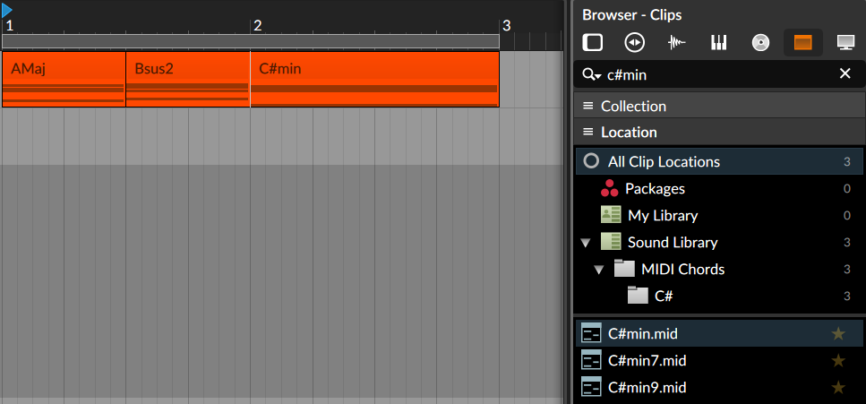

# MIDI Chord Pack

## Description

This projects generates MIDI chords (~350), which is published as a MIDI chord pack.

The goal is to have the MIDI files for quickly building a chord track, e.g. by searching for the chord in the DAW clip browser. When placed in the DAW the MIDI clips have a readable chord title.



A non-goal (see [background](#background)) is to generate chord progressions. If you are looking for this, consider instead:

* https://github.com/ldrolez/free-midi-chords
* Dedicated Tools / Plugins
    * My personal favorite is [Plugin Boutique Scaler 2](https://www.pluginboutique.com/meta_products/6414)

If you are missing any chords or have other feedback, feel free to reach out via [GitHub issues](https://github.com/Fannon/midi-chord-pack/issues).

## Download

Downloads can be found in the [releases page](https://github.com/Fannon/midi-chords/releases).

I consider adding chords with bass notes in the future as a separate download.

## Installation

This is only necessary if you want to customize and build your own chord pack, or contribute.

Prerequisites
* [Node.js](https://nodejs.org/en/)

```bash
# Install Node.js dependencies
npm install

# Generate Chords -> will be written to ./dist/
npm start
```

The generator script can be found in [src/generateChords.ts](./src/generateChords.ts).

## Background

Don't get scammed by paying money for chord packs :) 
There are free and better alternatives out there and this project should add one more that fits my own needs. 

I explicitly did not want to add chord progressions because I believe that this is usually done better by understanding a bit of music theory (e.g. [Circle of Fifths](https://en.wikipedia.org/wiki/Circle_of_fifths)) or using music theory related tools. By being forced to explicitly construct chord progressions from individual chords, much more interesting things ("happy accidents") can happen.

## Attribution 

* Inspired by https://github.com/ldrolez/free-midi-chords 
